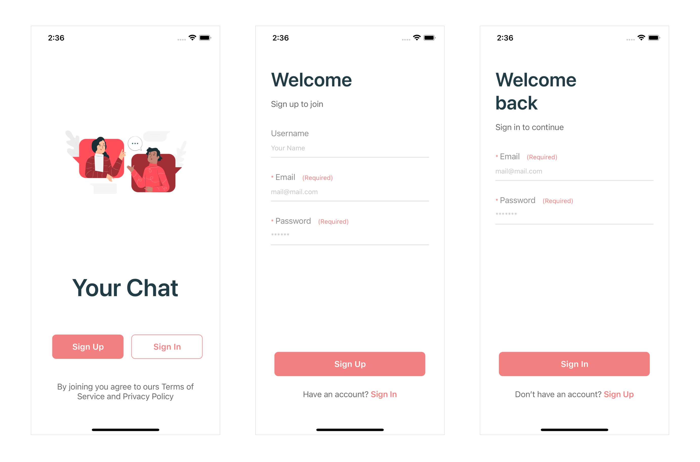
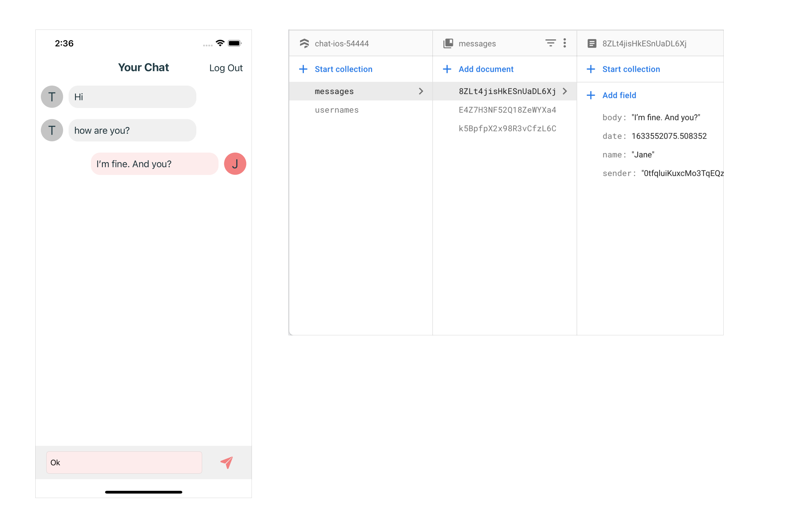
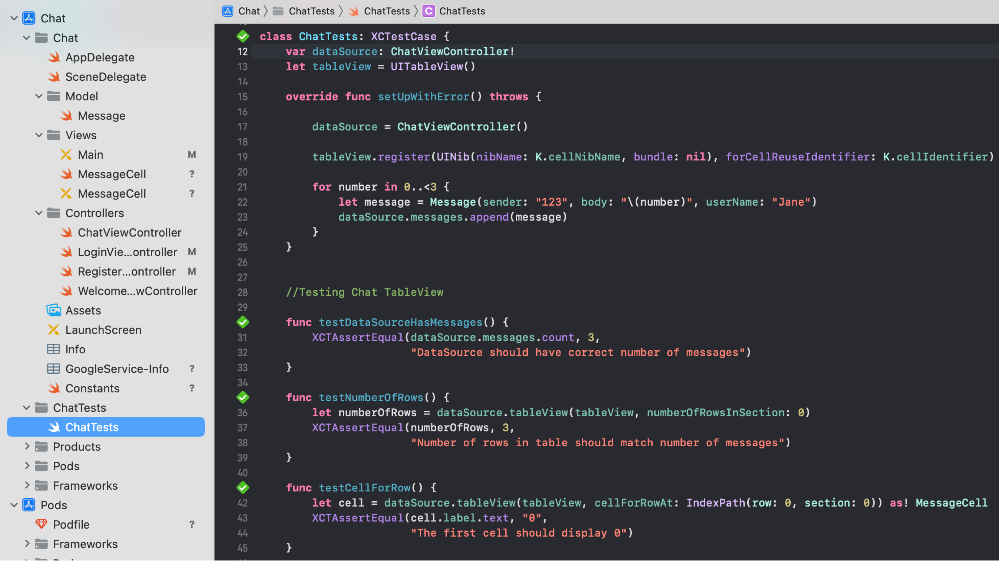

# Chat
## Overview

Chat is an iOS app developed in Swift 5 for iPhones.
This App was made by me, it uses Firebase to store data and allows you to send and receive messages, each person will have avatar with a first letter of his username.

## Features

* Swift Programming Language, Firebase Cloud database.
* UIStackView, UITableView, UITableViewCell, AttributedString



* UIKit, Firebase libraries installed using CocoaPods, "IQKeyboardManager" (to prevent keyboard covering the view) installed using Swift Package Manager. 



* MVC pattern, Unit tests for TableView




## How to build
1. Clone the repository
```
$ git clone https://github.com/EllaGlv/Chat-Swift-App-Firebase-XCTests.git
```
2. Open the project in Xcode
```
$ open "Chat.xcworkspace"
```
4. Compile and run the app in your simulator or on the device.

## Requirements

- Xcode
- iOS 15
- Swift 5
- Internet connection
